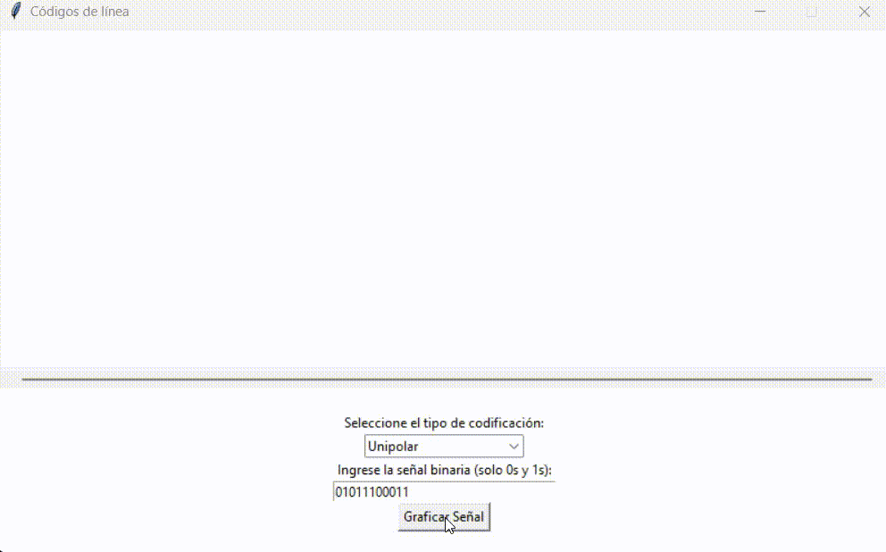
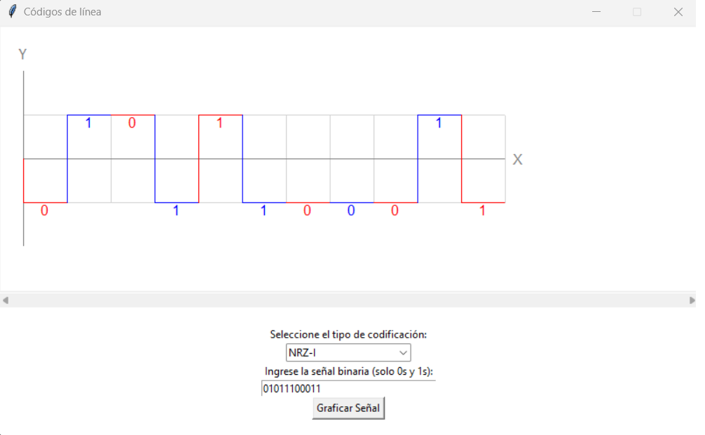
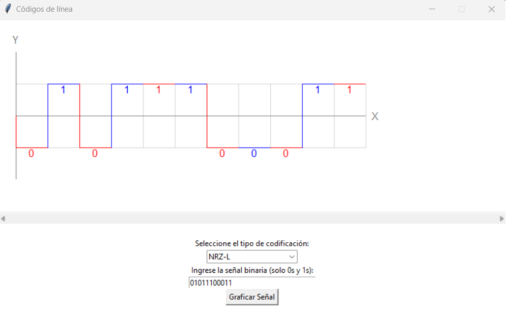
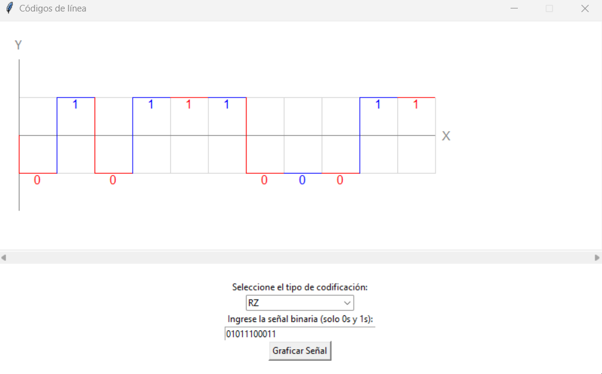
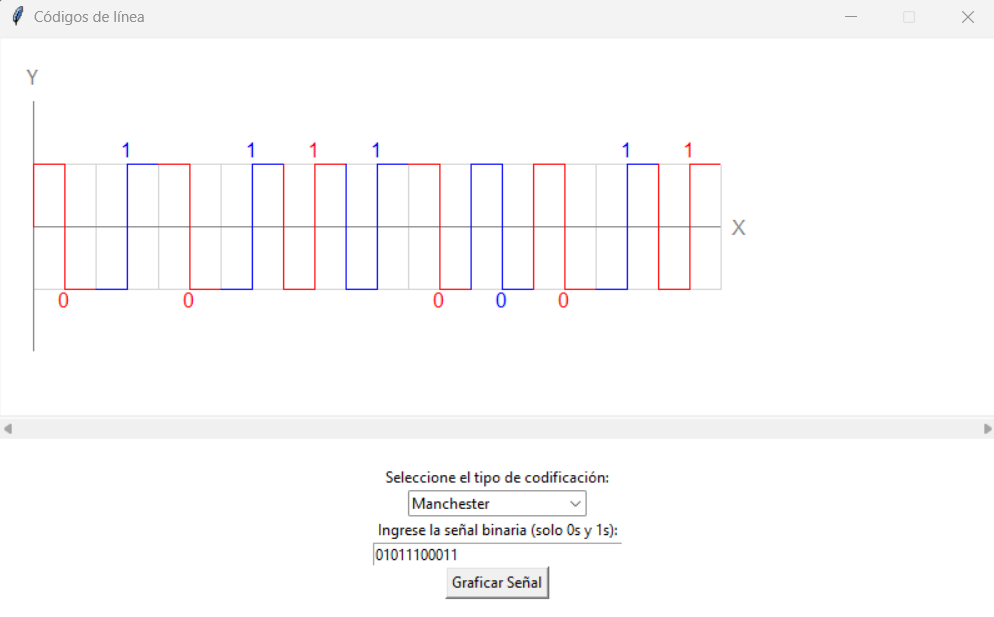
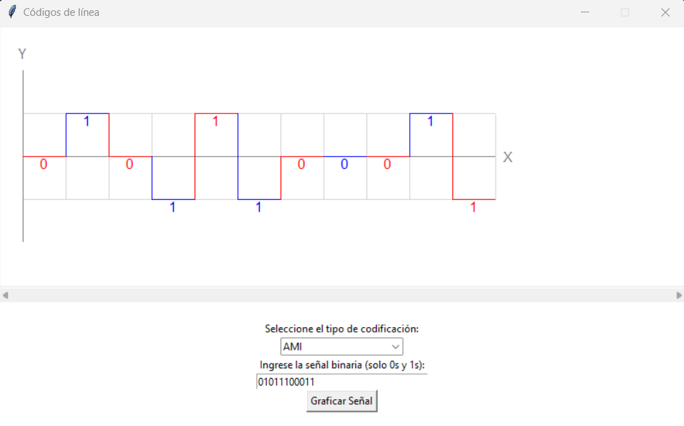
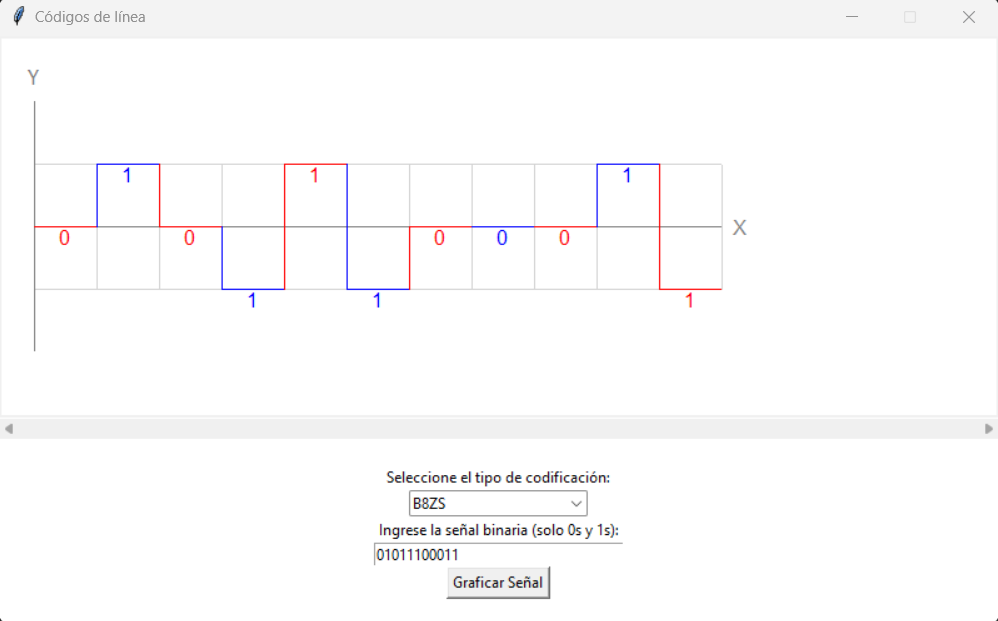

## Códigos de Línea en Python con Turtle y Tkinter

Este proyecto es una aplicación en Python que utiliza las bibliotecas Turtle y Tkinter para graficar diferentes tipos de codificación de señales binarias. La aplicación permite visualizar señales codificadas en varios formatos, incluyendo Unipolar, NRZ-I, NRZ-L, RZ, Manchester, AMI y B8ZS.

## GIF Funcionalidad
<p align="center">

</p>

## 📖 Características

- **Unipolar**: Codificación en la que los valores lógicos se representan con una única polaridad.
  <p align="center">
    
  </p>

- **NRZ-I (No Retorno a Cero Invertido)**: Codificación en la que el cambio de nivel representa los valores lógicos.
  <p align="center">
    
  </p>

- **NRZ-L (No Retorno a Cero Nivel)**: Codificación en la que el nivel de la señal representa los valores lógicos.
  <p align="center">
    
  </p>

- **RZ (Retorno a Cero)**: Codificación en la que la señal regresa al nivel base entre cada bit.
  <p align="center">
    
  </p>

- **Manchester**: Codificación en la que la transición en el medio de cada bit representa la información.
  <p align="center">
    
  </p>

- **AMI (Inversión Alterna de Marcado)**: Codificación bipolar con inversión alterna para los bits de uno.
  <p align="center">
    
  </p>

- **B8ZS (Bipolar con Sustitución de 8 Ceros)**: Codificación bipolar con sustitución de secuencias para cadenas de 8 ceros.
  <p align="center">
    
  </p>

## 📝 Fuente de Estudio

Para una explicación visual y más detallada sobre los códigos de línea, puedes consultar el siguiente video:

- [Introducción a los Códigos de Línea](https://www.youtube.com/watch?v=bkBX2D46G88)

## 🔧 Instalación

Para ejecutar este proyecto, asegúrate de tener Python 3.x instalado en tu sistema. Luego, clona este repositorio y ejecuta el script principal:

```bash
git clone https://github.com/Jisus_Dev/CODIGOS-DE-LINEA.git
cd CODIGOS-DE-LINEA
python Graficadora.py
```

## 🔧 Uso

1. Ejecuta el script `Graficadora.py`.
2. En la interfaz gráfica, selecciona el tipo de codificación que deseas utilizar en el menú desplegable.
3. Ingresa una señal binaria (compuesta solo por 0s y 1s) en el campo de entrada.
4. Haz clic en el botón "Graficar Señal" para visualizar la señal codificada en el área de dibujo.

## ⭐ Agradecimiento

Puede agradecer el contenido presentado en este repositorio siguiendo mi perfil y/o marcando este repositorio con una estrella.

Cualquier duda o aclaración puede contactarme usando los medios de comunicación de mi perfil [Jisus_Dev](https://github.com/Jisus-Dev)